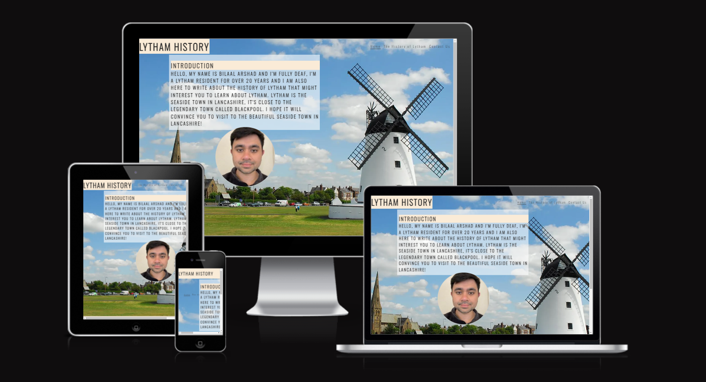
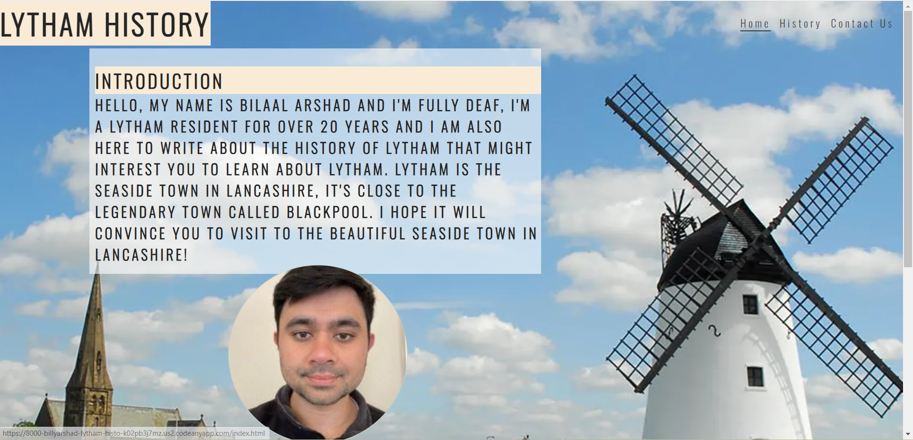

# **Site Title**

Lytham History

## **Site Overview**

I've decided to create the history project about Lytham as I'm a local resident for over 20 years. It's here to offer people from around the world to come to Lytham for a visit. It's filled of beautiful history of Lytham. It's appealing to young and old people who's travelling around the world.

​
## Table of contents:
- [**Site Title**](#site-title)
  - [**Site Overview**](#site-overview)
  - [Table of contents:](#table-of-contents)
  - [**Planning stage**](#planning-stage)
    - [**Target Audiences:**](#target-audiences)
    - [**User Stories:**](#user-stories)
    - [**Site Aims:**](#site-aims)
    - [**Wireframes:**](#wireframes)
    - [**Color Scheme:**](#color-scheme)
  - [**Typography**](#typography)
  - [**Current Features Common to all pages**](#current-features-common-to-all-pages)
      - [*Navigation Bar:*](#navigation-bar)
      - [\*features](#features)
  - [**Future-Enhancements**](#future-enhancements)
  - [**Testing Phase**](#testing-phase)
  - [**Bugs**](#bugs)
  - [**Deployment**](#deployment)
  - [**Tech**](#tech)
  - [**Credits**](#credits)
    - [**Honorable mentions**](#honorable-mentions)
    - [**Content:**](#content)
    - [**Media:**](#media)
## **Planning stage**
### **Target Audiences:**
​
Users wants to know more about Lytham as they haven't been there before.
Users loves to see the seaside town in the north-west of England.
Users loves to travel around the world

### **User Stories:**
​
* I want to navigate the pages in the Lytham history website
* I want to learn more about Lytham before I come here in Lytham
* I want to contact the local for more information about Lytham.
​
### **Site Aims:**
​
My website is aimed to persuade the travellers who hasn't been visited to Lytham before. Because they're usually going to Lakes District which is the most popular mountain in the UK. I hope they will come here in Lytham through my website.
​
​
### **Wireframes:**
​
I have created my Lytham History wireframes from the software called Balsamiq Wireframes.

Sometimes I need to change if it doesn't work out. 
​
### **Color Scheme:**
​
I have decided to choose colours for my home page design:

#eaded2f7
#antiquewhite
#3a3a3a
#252525

for the footer icons:

#royalblue

For the contact form design:

#010577
#white
#4169e1
#bab3cd
#ccc

For the history page design:

#040202
rgba(255, 255, 255, 0.6)
​
## **Typography**
​
* There are three fonts I have used:
  * Edu SA
  * Oswald 
  * Lato
​
* All fonts were sourced from Google fonts in the Credits section.
​
## **Current Features Common to all pages**
​
#### *Navigation Bar:*

* I gave the user links to each section of the Home, History and Contact pages.
* There are each option that are presented to the user to make it reable.
* On the mobile screens, there are pictures of lytham windmill, lytham library and lytham people to make sure mobile sures have no problem reading my history page.
​
#### *features
​
* Home-Page: I have added my personal image to the home page to introduce myself as a local resident in Lytham for over 20 years.
* History-Page: I have put 4 different images in the history page to introduce them about the history of Lytham.
* Contact-Form: I have included the contact form to allow users to contact me.
​
## **Future-Enhancements**
​
A webpage is a living beast it's going to evolve past the initial stages of release generally, it's always good to discuss where you this the page may go in the future
​
* At the time of making this page i didn't have the understanding to actual send e-mails from the contact form so intergration with email.js to send e-mails would improve the users experience
​
* Due to the subject matter, we have discussed the idea of including a small JS game to engage the user
​
## **Testing Phase**
​
* Validators - I was supposed to take images from the html and css validator websites, but due to the strange bugs depsite my best efforts to add them, I had to leave them out and I am writing down instead.

Here are the messages that I wrote from HTML and CSS validators

W3 HTML validator: 

*Error: End tag section seen, but there were open elements.

From line 41, column 5; to line 41, column 14

/div>↩    </section>↩    <

Error: Unclosed element div.

From line 32, column 9; to line 32, column 29

>↩        
↩

W3C CSS validator:

W3C CSS Validator results for <https://billyarshad.github.io/Lytham_History_PP1/> (CSS level 3 + SVG)
Congratulations! No Error Found.
This document validates as CSS level 3 + SVG !
​
## **Bugs**
​
I went through the testing phase all day. and there was no bugs in my website.

## **Deployment**
I deployed the page on GitHub pages via the following procedure: -
​
1. From my Lytham History project [repository](https://github.com/BillyArshad/Lytham_History_PP1), go to the **Settings** tab.
2. From the left-hand menu, select the **Pages** tab.
3. Under the **Source** section, select the **Main** branch from the drop-down menu and click **Save**.
4. A message will be displayed to indicate a successful deployment to GitHub pages and provide the live link.
​
You can find the live site via the following URL - [live webpage](https://billyarshad.github.io/Lytham_History_PP1/)

***
​
## **Tech**
​
- HTML
- CSS
​
## **Credits**
### **Honorable mentions**
​
Richard Wells (My mentor)
Thogdad (the infamous British football youtuber) mentioned that he has a family living in Lytham via Instagram
​
### **Content:**
​
<https://www.w3schools.com/howto/howto_css_contact_form.asp>
<https://fonts.google.com/>
<https://fontawesome.com/icons>
  
### **Media:**
​
<https://www.fswaste.co.uk/wp-content/uploads/2022/12/waste-management-in-lytham-st-annes.webp>
<https://www.visitlytham.info/about/seafront/lytham-windmill/>
<https://en.wikipedia.org/wiki/Lytham_Library>
<https://www.famousbirthdays.com/faces/thogdad-image.jpg>
<https://www.google.com/url?sa=i&url=https%3A%2F%2Ftwitter.com%2Fthogdad%2Fstatus%2F1166490524787908614&psig=AOvVaw1L4n_TfWgqIXiPgmGwVRkR&ust=1691325736099000&source=images&cd=vfe&opi=89978449&ved=0CBAQjRxqFwoTCIClp-3SxYADFQAAAAAdAAAAABAE>
